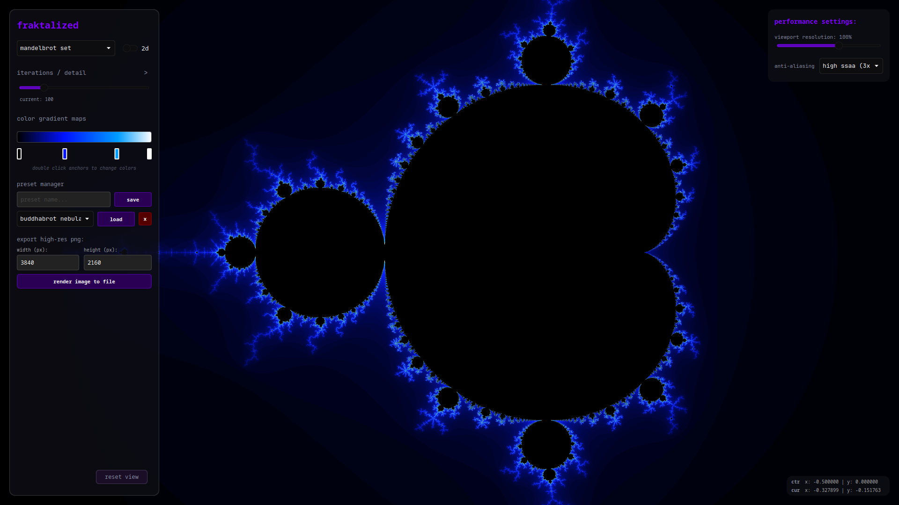
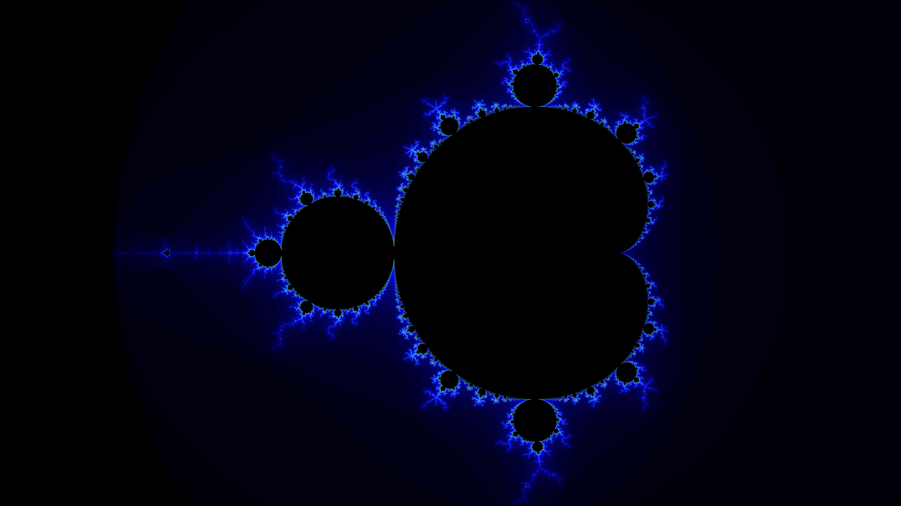
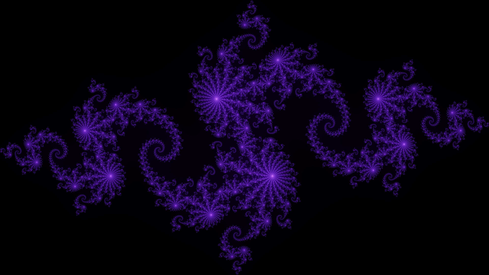
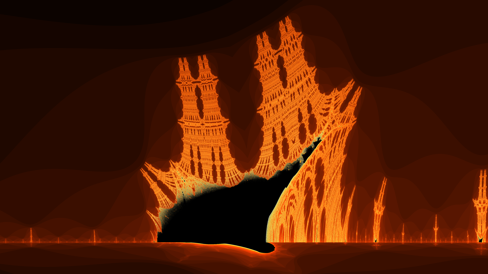
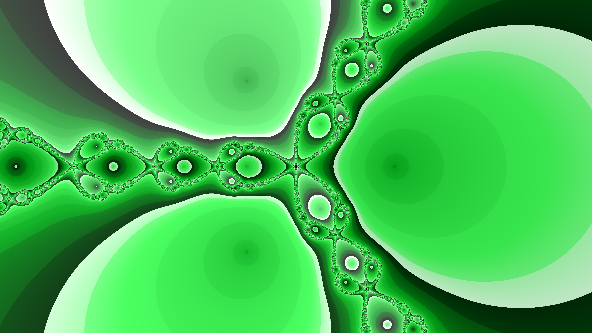
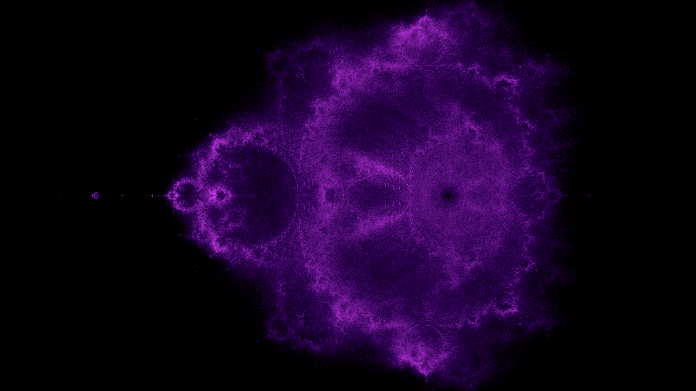
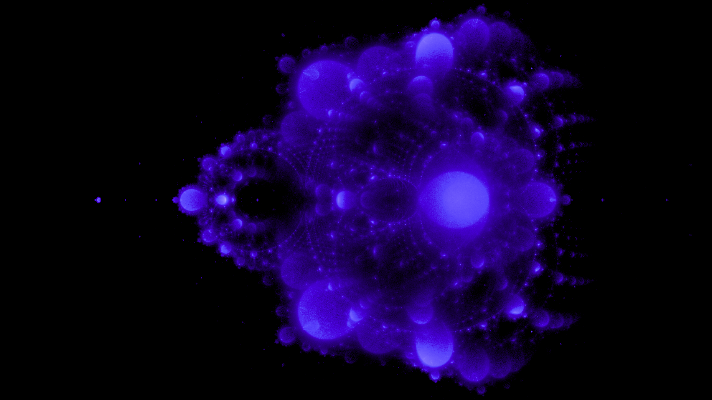
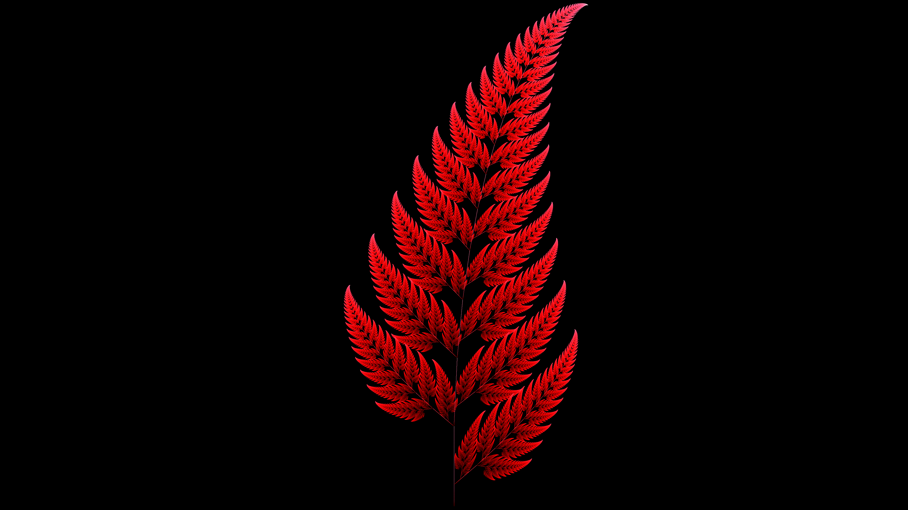

```
                    ____           __   __        ___                __
                   / __/________ _/ /__/ /_____ _/ (_)___  ___  ____/ /
                  / /_/ ___/ __ `/ //_/ __/ __ `/ / /_  / / _ \/ __  / 
                 / __/ /  / /_/ / ,< / /_/ /_/ / / / / /_/  __/ /_/ /  
                /_/ /_/   \__,_/_/|_|\__/\__,_/_/_/ /___/\___/\__,_/
                                the open-source, cross-platform fractal explorer
```


an open-source, cross-platform, ultra smooth real time fractal explorer
built using a hybrid architecture of Qt6 (QML/C++) and openGL (GLSL 330 core / 4.3 compute shaders).



fraktalized uses a split-threaded system where a floating sidebar interface
controls a high-performance fragment shader inside a dedicated framebuffer object running off of
fragment `.frag`/`.vert`, and compute `.glsl` shader files.

---

## technical features:

* **multithreaded fbo rendering:** isolates raw openGL, gpu heavy stuff from the main ui system by using `QQuickFramebufferObject`, in order to keep the ui responsive even if your gpu is pinned at 100% usage
* **full 64 bit depth:** uses 64 bit `double` systems for maximum zooming depth and accuracy.
* **camera smoothing:** the camera system uses `lerp` (or `QQuaternion::slerp` in 3d) to make the camera feel very smooth and cinematic
* **procedural gradient-based colors:** user controlled, real time, gradient-based color mapping system that supports up to 16 stops for beautiful, fully customizable color setup with a slight quadratic brightness boost at the edges.
* **render to file:** you can render any fractal at any location easily with any custom resolution, just position the camera and change your settings to what you want, and hit render. to help prevent your graphics card from exploding, it also renders in 2000x2000px tiles.
* **SSAA anti-aliasing:** utilizes super-sampling anti-aliasing to give super smooth looking visuals. you can choose off, 2x, or 3x ssaa, giving smoother images at the cost of gpu usage
* **JSON preset system:** you can save any color, position and zoom setup to a JSON file on your computer for later reference, in case you forget. it is also super easy to delete said JSON entries if you make a mistake
* **adjustable resolution scale:** use the resolution scale slider to set your resolution anywhere from 25% to 150% of the active window resolution
* **multiple fractal types:** fraktalized currently supports 4 distinct fractal types

---

## available fractals:

fraktalized currently has 10 fractal sets:

* **mandelbrot set:** the classic fractal set
* **julia set:** cool swirly stuff, complete with adjustable constant coords
* **burning ship set:** cool pointy stuff
* **newton set:** kinda spidery looking
* **buddhabrot:** like the mandelbrot but galaxy looking
* **anti-buddhabrot:** reverse buddhabrot
* **barnsley fern:** looks very naturey
* **mandelbulb:** like the mandelbrot but 3d
* **menger sponge:** cube, but with infinite* surface area
* **icebox:** spiky box!

### current fractal types:

fraktalized currently has 4 fractal types:

* **escape time fractals:** the classic fractal type, generated by iterating mathematical formulas across the complex plane to determine if a point's orbit diverges, then mapping that pixel to the screen.
* **trajectory fractals:** similar to escape time, but instead of just testing if a point escapes, these map the trajectory that a point takes as it escapes, leading to very beautiful, nebula-like images.
* **iterated function system fractals:** these are generated by taking a starting point, then repeatedly applying a set of affine transformations thousands of times, creating complex, self-similar patterns.
* **3d mandelmorphic fractals:** basically 3d mandelbrot

---

## mathy information:

for if you're curious about how all the nerdy math stuff works

### 2d escape time:

these fractals are rendered by computing the escape-time behavior of a math function on the complex plane (basically, this just means tracking how many times you can repeat a function before its value escapes a set boundary). 
for each pixel, the coordinates are mapped to a complex number $c = x + yi$, and the engine repeatedly evaluates the quadratic recurrence relation:

$$Z_{n+1} = Z_n^2 + c$$ 

but because these are complex numbers, it expands to: 

$$z^2 = (x + yi)^2 = x^2 - y^2 + 2xyi$$

and in the code, it gets split into its real and imaginary parts:

* $x_{new} = x^2 - y^2 + c_{real}$
* $y_{new} = 2xy + c_{imag}$

starting at $Z_0 = 0$ (for the mandelbrot set), the engine checks if the magnitude $|Z| = \sqrt{x^2 + y^2}$ escapes a specific threshold (typically $|Z| > 2$, since any point exceeding a radius of 2 is always gonna to escape to infinity) within a maximum iteration limit.

the iteration count that it escapes at determines the color of the pixel. however, if it just gets mapped directly, it results in harsh color banding, so a continuous potential formula is applied to smooth the colors out:

$$\nu = i + 1 - \frac{\ln(\ln(|Z|))}{\ln(2)}$$

where $i$ is the raw iteration count at escape, and $|Z|$ is the magnitude of the complex number at escape.

### 2d trajectory orbit traps

this one is similar to 2d escape time, except instead of only rendering *when* a point escapes, trajectory rendering shows the path of the orbit that $Z$ takes across the complex plane during iterations.

as $Z$ iterates through $Z_{n+1} = Z_n^2 + c$, its location is constantly compared against a shape (acting as an orbit trap). orbit traps can be almost any shape, including lines, points or circles. the engine then determines the minimum distance $d$ between the points and the trap across all the iterations:

$$d_{min} = \min_{k=0}^{N} \Big( \text{distance}(Z_k, \text{trap}) \Big)$$

for a simple point trap at the origin $(0, 0)$, the distance is just the standard euclidean distance:

$$d = \sqrt{x_k^2 + y_k^2}$$

this distance is then normalized and mapped to the color gradient, making the nebula-like trails of the fractals convergence behavior

### 2d iterated function systems (ifs):

iterated function systems make fractals using probabilites and contractive affine transformations.

an affine transformation (in 2d) basically just scales, rotates, shears, or translates a point. mathematically, it is expressed with matrix multiplication and a translation vector:

$$\begin{bmatrix} x_{n+1} \\ y_{n+1} \end{bmatrix} = \begin{bmatrix} a & b \\ c & d \end{bmatrix} \begin{bmatrix} x_n \\ y_n \end{bmatrix} + \begin{bmatrix} e \\ f \end{bmatrix}$$

which expands to:

* $x_{n+1} = ax_n + by_n + e$
* $y_{n+1} = cx_n + dy_n + f$

a typical ifs has a set of multiple transformations $(W_1, W_2, \dots, W_m)$, each with its own probability $p_i$ such that $\sum p_i = 1$.

the engine starts with a random point, and on every iteration it randomly selects one of the transformations based on its probability weights, transforms, and plots at the new coords. because the transformations are contractive (meaning they pull points closer together), repeating this causes the points to organize into a detailed and self similar fractal attractor.

### 3d raymarching and distance estimators:

since 3d fractals are technically infinitely detailed, using traditional polygons or triangles would result in a gpu explosion (bad). instead, fraktalized uses **raymarching** combined with **signed distance fields** (or SDFs) inside openGL fragment (`.frag`) shaders.

for each screen pixel, a raycast is sent from the camera positon $\vec{o}$ along a direction vector $\vec{d}$. the position of the ray at any total distance $t$ is defined as: 

$$\vec{p}(t) = \vec{o} + t\vec{d}$$

#### raymarching loop:

this is different from normal raytracing in the sense that instead of calculating intersections, raymarching evaluates a **distance estimator (or DE)** function at the current point $\vec{p}$. the de returns the max distance the ray can travel in *any direction* without hitting anything, and then the ray steps forwards by exactly that distance ($t = t + \text{DE}(\vec{p})$), and the loop repeats. if $\text{DE}(\vec{p})$ falls below a very small threshold (for example, $0.001$), a hit is registered and the pixel is shaded.

#### mandelbulb distance estimator:

to find the surface of a 3d mandelbulb fractal, the distance estimator converts the 3d cartesian coords $(x, y, z)$ into spherical coords (radius $r$, theta $\theta$, and phi $\phi$):

$$r = \sqrt{x^2 + y^2 + z^2}$$
$$\theta = \arctan2(\sqrt{x^2 + y^2}, z)$$
$$\phi = \arctan2(y, x)$$

the point is then iterated using an $n$-th power scaling system (typically power $n = 8$ for a normal mandelbulb):

$$\vec{p}_{next} = r^n \begin{bmatrix} \sin(n\theta)\cos(n\phi) \\ \sin(n\theta)\sin(n\phi) \\ \cos(n\theta) \end{bmatrix} + \vec{c}$$

to determine the max stepping distance without clipping through the fractal's geometry, the engine simultaneously tracks both the running derivative ($dr$) of the space distortion. the final estimated distance to the surface is completed using the **hubbard-douady potential estimate**:

$$\text{Distance} = 0.5 \cdot \frac{r}{\ln(r)} \cdot dr$$

---

## gallery:


*above: mandelbrot fractal set, blue (3840x2160)*

 


*above: julia fractal set, -0.8 + 0.156i, purple (3840x2160)*

 


*above: burning ship fractal set, orange (3840x2160)*

 


*above: newton fractal set, green (3840x2160)*

 


*above: buddhabrot fractal set, purple (3840x2160)*

 


*above: anti-buddhabrot fractal set, indigo (3840x2160)*

 


*above: barnsley fern fractal set, red (3840x2160)*

 

---

## controls:

* **left click + drag:** camera pan
* **scroll wheel:** zoom
* **sidebar controls:** for iterations, color, adjusting julia set constant, rendering to file, and more
* **settings panel:** for resolution scale and anti-aliasing
* **3d mode classic controls:**
  * click and drag: rotate
  * scroll: zoom
  * shift + click and drag: pan
* **3d mode wasd controls:**
  * w, a, s, d, space (or q), shift (or e): move
  * click and drag: look around
  * scroll: change speed

---

## techy information:

* **language:** C++ 20
* **framework:** Qt 6 (QML, quick)
* **graphics api:** openGL (GLSL 330 core)
* **ide:** JetBrains CLion
* **platform support:** since its Qt, basically all of them (tested on fedora 44)

---

## ai disclosure:

no generative ai or LLMs were used to write or debug any of this code or documentation

---

created by **SwedishSplidney** for Hack Club Stardance 2026